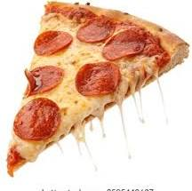

# 🍕 Pizza Bites - Landing Page

Welcome to **Pizza Bites**, a delicious and visually appealing landing page created using **HTML, CSS, and JavaScript**. This is a frontend-only project designed to showcase UI/UX design skills for a pizza delivery or fast food brand.

 

## 🔥 Features

- 🍕 Clean and modern UI
- 📱 Responsive design for all screen sizes
- 🎨 Stylish menu section with attractive images
- 🔗 Smooth navigation experience
- ✨ Interactive buttons and sections

## 🛠️ Tech Stack

- HTML5
- CSS3 (with animations)
- Vanilla JavaScript

## 📂 Folder Structure

pizza-bites/
├── images/
├── index.html
├── style.css
├── script.js 


## 🚀 Live Demo

> Hosted on  GitHub Pages:
🔗 Click Here to View Pizza Bites  : https://niharika1008.github.io/Pizza-Bites/

## 📸 Screenshots ##

| Home Page | Menu Section |
|-----------|--------------|
|  |  |

## 👩‍💻 Created By

**Niharika Chunchu**  
GitHub: [@Niharika1008](https://github.com/Niharika1008)  
Email: [niharikachunchu10@gmail.com](mailto:niharikachunchu10@gmail.com)

---

## 📌 How to Use

1. Clone the repository:
   ```bash
   git clone https://github.com/Niharika1008/Pizza-Bites.git
